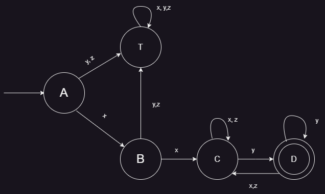

# Prueba Automata

Dar un autómata que acepte el siguiente lenguaje: que empiece con x, continúe con x, continúe con cualquier cosa, pero termina con y. sobre:

∑ = {x,y,z}

El automata solicitado sería el siguiente:

| Estado | x   | y   | z   |
| ------ | --- | --- | --- |
| A      | B   | T   | T   |
| B      | C   | T   | T   |
| C      | C   | D   | C   |
| D      | C   | D   | C   |
| T      | T   | T   | T   |
